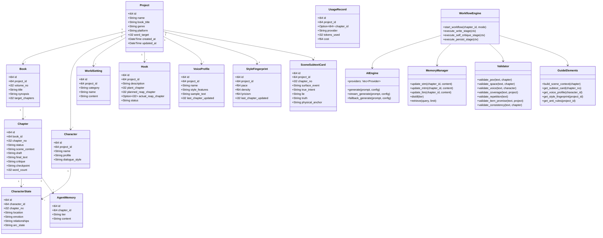
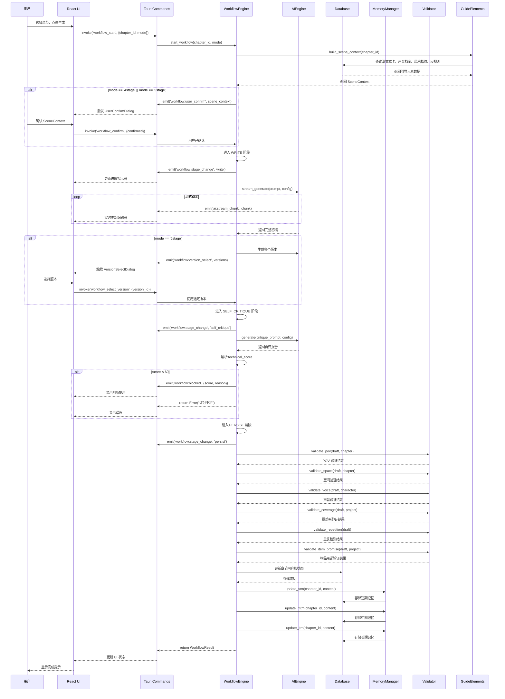
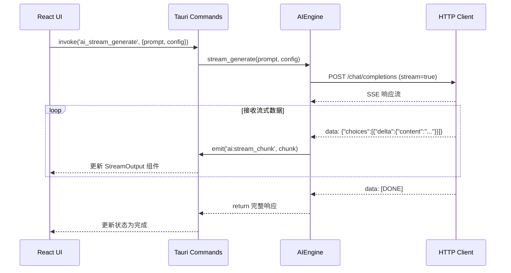
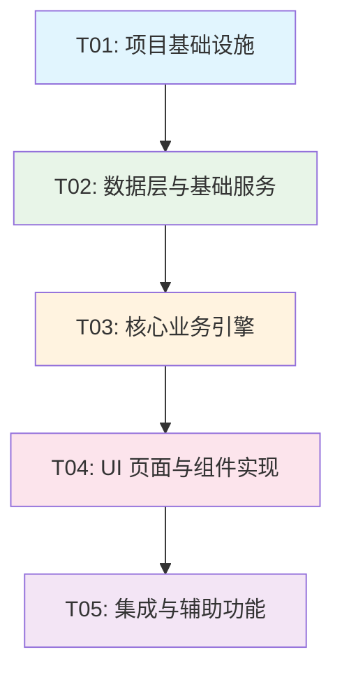

# novel-writer-pure v4 系统架构设计

> **项目信息**
> - 架构师：高见远 (Bob)
> - 设计时间：2025-06-07
> - 基于 PRD：v4 重写版本
> - 技术栈：Rust + Tauri 2.x + React 18 + TypeScript + Vite + Tailwind CSS

---

## Part A: 系统设计

### 1. 实现方案

#### 1.1 核心技术挑战

| 挑战 | 解决方案 |
|------|----------|
| **跨进程通信** | Tauri IPC 命令 + 事件流实现前后端通信 |
| **流式输出** | Tauri 事件系统 + React 状态管理实现实时流式更新 |
| **大数据编辑** | TipTap 虚拟滚动 + 分页加载保证 10000+ 行性能 |
| **启动性能** | Rust 预编译 + React 懒加载 + 最小化初始加载 |
| **内存管理** | Rust 所有权系统 + 引用计数 + 定期清理 |

#### 1.2 框架选型

| 层级 | 技术 | 版本 | 选型理由 |
|------|------|------|----------|
| **前端框架** | React | ^18.2.0 | 生态成熟，组件化开发 |
| **类型系统** | TypeScript | ^5.0.0 | 类型安全，减少运行时错误 |
| **构建工具** | Vite | ^5.0.0 | 快速开发构建，HMR 热更新 |
| **CSS 框架** | Tailwind CSS | ^3.4.0 | 工具类优先，性能优于组件库 |
| **状态管理** | Zustand | ^4.5.0 | 轻量级，TypeScript 友好 |
| **富文本编辑器** | TipTap | ^2.5.0 | 基于 ProseMirror，扩展性强 |
| **桌面框架** | Tauri | ^2.0.0 | Rust 后端，体积小，性能高 |
| **数据库** | SQLite + rusqlite | ^0.31.0 | 嵌入式，无外部依赖 |
| **AI SDK** | 自研 HTTP 客户端 | - | 统一 27+ Provider 接口 |

#### 1.3 架构模式

采用 **分层架构 + 模块化设计**：

```
┌─────────────────────────────────────────────────────┐
│                  UI Layer (React)                   │
│  ┌──────────┐ ┌──────────┐ ┌──────────┐            │
│  │  Pages   │ │Components│ │  Hooks   │            │
│  └──────────┘ └──────────┘ └──────────┘            │
│  ┌──────────┐ ┌──────────┐ ┌──────────┐            │
│  │  Stores  │ │ Services │ │  Utils   │            │
│  └──────────┘ └──────────┘ └──────────┘            │
└────────────────────────┬────────────────────────────┘
                         │ IPC
┌────────────────────────┴────────────────────────────┐
│              Tauri Bridge (IPC Layer)               │
│  ┌──────────┐ ┌──────────┐ ┌──────────┐            │
│  │ Commands │ │  Events  │ │  State   │            │
│  └──────────┘ └──────────┘ └──────────┘            │
└────────────────────────┬────────────────────────────┘
                         │
┌────────────────────────┴────────────────────────────┐
│            Business Logic (Rust Crates)             │
│  ┌─────────┐ ┌─────────┐ ┌─────────┐ ┌─────────┐  │
│  │   db    │ │   ai    │ │workflow │ │ memory  │  │
│  └─────────┘ └─────────┘ └─────────┘ └─────────┘  │
│  ┌─────────┐ ┌─────────┐ ┌─────────┐ ┌─────────┐  │
│  │validator│ │  guide  │ │ plugin  │ │  utils  │  │
│  └─────────┘ └─────────┘ └─────────┘ └─────────┘  │
└────────────────────────┬────────────────────────────┘
                         │
┌────────────────────────┴────────────────────────────┐
│               Data Layer (SQLite)                   │
│  ┌──────────────────────────────────────────────┐   │
│  │  rusqlite + WAL mode + 12 tables             │   │
│  └──────────────────────────────────────────────┘   │
└─────────────────────────────────────────────────────┘
```

---

### 2. 文件列表

#### 2.1 项目根目录

```
novel-writer-pure/
├── src-tauri/                          # Rust 后端
│   ├── Cargo.toml
│   ├── tauri.conf.json
│   ├── build.rs
│   ├── icons/
│   └── src/
│       ├── main.rs                     # Tauri 入口
│       ├── lib.rs                      # 库入口，暴露模块
│       ├── db/                         # 数据库模块
│       │   ├── mod.rs
│       │   ├── schema.rs              # 表结构定义
│       │   ├── migrations.rs          # 数据库迁移
│       │   └── repositories/          # 数据访问层
│       │       ├── mod.rs
│       │       ├── project.rs
│       │       ├── book.rs
│       │       ├── chapter.rs
│       │       ├── character.rs
│       │       ├── world_setting.rs
│       │       ├── hook.rs
│       │       ├── voice_profile.rs
│       │       ├── style_fingerprint.rs
│       │       ├── agent_memory.rs
│       │       ├── usage_record.rs
│       │       └── scene_subtext_card.rs
│       ├── ai/                         # AI 引擎
│       │   ├── mod.rs
│       │   ├── provider.rs            # Provider 管理
│       │   ├── client.rs              # HTTP 客户端
│       │   ├── stream.rs              # 流式输出
│       │   ├── prompt.rs              # Prompt 管理
│       │   └── providers/             # 各 Provider 实现
│       │       ├── mod.rs
│       │       ├── openai.rs
│       │       ├── anthropic.rs
│       │       ├── deepseek.rs
│       │       └── ...
│       ├── workflow/                   # 工作流引擎
│       │   ├── mod.rs
│       │   ├── engine.rs              # 核心引擎
│       │   ├── scene_context.rs       # SceneContext 构造
│       │   ├── stages/                # 工作流阶段
│       │   │   ├── mod.rs
│       │   │   ├── write.rs
│       │   │   ├── self_critique.rs
│       │   │   ├── persist.rs
│       │   │   ├── user_confirm.rs
│       │   │   └── version_select.rs
│       │   └── models.rs              # 工作流数据模型
│       ├── memory/                     # 记忆层
│       │   ├── mod.rs
│       │   ├── stm.rs                 # 短期记忆
│       │   ├── mtm.rs                 # 中期记忆
│       │   ├── ltm.rs                 # 长期记忆
│       │   ├── distill.rs             # 蒸馏逻辑
│       │   ├── rag.rs                 # RAG 检索
│       │   └── models.rs              # 记忆数据模型
│       ├── validator/                  # 验证器
│       │   ├── mod.rs
│       │   ├── pov.rs                 # POV 验证
│       │   ├── space.rs               # 空间验证
│       │   ├── voice.rs               # 声音验证
│       │   ├── coverage.rs            # 设定覆盖率
│       │   ├── repetition.rs          # 重复检测
│       │   ├── item_promise.rs        # 物品承诺
│       │   └── consistency.rs         # 跨章一致性
│       ├── guide/                      # 引导元素
│       │   ├── mod.rs
│       │   ├── subtext_card.rs        # 潜文本卡
│       │   ├── voice_profile.rs       # 声音档案
│       │   ├── style_fingerprint.rs   # 风格指纹
│       │   └── anti_rule.rs           # 反规则
│       ├── plugin/                     # 插件系统
│       │   ├── mod.rs
│       │   ├── manager.rs             # 插件管理器
│       │   └── builtin/               # 内置插件
│       │       ├── mod.rs
│       │       ├── plot_deduction.rs
│       │       ├── outline_gen.rs
│       │       └── tts_edge.rs
│       ├── commands/                   # Tauri 命令
│       │   ├── mod.rs
│       │   ├── project.rs             # 项目管理命令
│       │   ├── chapter.rs             # 章节命令
│       │   ├── character.rs           # 角色命令
│       │   ├── world_setting.rs       # 世界观命令
│       │   ├── workflow.rs            # 工作流命令
│       │   ├── ai.rs                  # AI 命令
│       │   ├── memory.rs              # 记忆命令
│       │   ├── validator.rs           # 验证器命令
│       │   ├── guide.rs               # 引导元素命令
│       │   ├── plugin.rs              # 插件命令
│       │   └── system.rs              # 系统命令
│       └── utils/                      # 工具模块
│           ├── mod.rs
│           ├── config.rs              # 配置管理
│           ├── logger.rs              # 日志系统
│           └── error.rs               # 错误处理
├── src/                                # React 前端
│   ├── main.tsx                        # 入口文件
│   ├── App.tsx                         # 根组件
│   ├── vite-env.d.ts                   # Vite 类型声明
│   ├── assets/                         # 静态资源
│   │   ├── styles/
│   │   │   ├── globals.css            # 全局样式
│   │   │   └── tailwind.css           # Tailwind 入口
│   │   ├── fonts/
│   │   └── images/
│   ├── components/                     # 通用组件
│   │   ├── layout/
│   │   │   ├── AppLayout.tsx          # 主布局
│   │   │   ├── Sidebar.tsx            # 侧栏
│   │   │   ├── TopBar.tsx             # 顶栏
│   │   │   ├── StatusBar.tsx          # 状态栏
│   │   │   └── TabContent.tsx         # Tab 内容区
│   │   ├── ui/                         # 基础 UI 组件
│   │   │   ├── Button.tsx
│   │   │   ├── Input.tsx
│   │   │   ├── Select.tsx
│   │   │   ├── Dialog.tsx
│   │   │   ├── Card.tsx
│   │   │   ├── Table.tsx
│   │   │   ├── Tabs.tsx
│   │   │   ├── Tooltip.tsx
│   │   │   ├── Dropdown.tsx
│   │   │   ├── Modal.tsx
│   │   │   ├── Toast.tsx
│   │   │   ├── Spinner.tsx
│   │   │   └── index.ts               # 导出所有 UI 组件
│   │   ├── editor/                     # 编辑器组件
│   │   │   ├── RichTextEditor.tsx
│   │   │   ├── MarkdownPreview.tsx
│   │   │   └── EditorToolbar.tsx
│   │   ├── chart/                      # 图表组件
│   │   │   ├── LineChart.tsx
│   │   │   ├── BarChart.tsx
│   │   │   └── PieChart.tsx
│   │   └── workflow/                   # 工作流组件
│   │       ├── StepIndicator.tsx
│   │       ├── StreamOutput.tsx
│   │       └── CritiqueReport.tsx
│   ├── pages/                          # 页面组件
│   │   ├── novel-settings/             # 小说设定页
│   │   │   ├── NovelSettingsPage.tsx
│   │   │   ├── GlobalSettings.tsx
│   │   │   ├── WorldSettings.tsx
│   │   │   ├── CharacterManager.tsx
│   │   │   ├── OutlineEditor.tsx
│   │   │   └── components/
│   │   │       ├── TreeNavigation.tsx
│   │   │       └── DetailEditor.tsx
│   │   ├── chapter-generation/         # 章节生成页
│   │   │   ├── ChapterGenerationPage.tsx
│   │   │   ├── ChapterSelector.tsx
│   │   │   ├── AgentConfig.tsx
│   │   │   ├── GenerationResult.tsx
│   │   │   └── ProgressPanel.tsx
│   │   ├── chapter-editor/             # 章节编辑页
│   │   │   ├── ChapterEditorPage.tsx
│   │   │   ├── ChapterTree.tsx
│   │   │   ├── EditorArea.tsx
│   │   │   └── CritiquePanel.tsx
│   │   ├── dashboard/                  # 仪表盘页
│   │   │   ├── DashboardPage.tsx
│   │   │   ├── MetricCards.tsx
│   │   │   ├── TrendChart.tsx
│   │   │   └── ChapterTable.tsx
│   │   ├── narrative-workshop/         # 叙事工坊页
│   │   │   ├── NarrativeWorkshopPage.tsx
│   │   │   └── panels/
│   │   │       ├── PressurePanel.tsx
│   │   │       ├── EmotionPanel.tsx
│   │   │       ├── RhythmPanel.tsx
│   │   │       ├── InfoGapPanel.tsx
│   │   │       ├── DedupPanel.tsx
│   │   │       ├── BlankPanel.tsx
│   │   │       └── ConsistencyPanel.tsx
│   │   └── memory-management/          # 记忆管理页
│   │       ├── MemoryManagementPage.tsx
│   │       ├── DistillView.tsx
│   │       ├── RagView.tsx
│   │       └── Overview.tsx
│   ├── dialogs/                        # 对话框组件
│   │   ├── WelcomeDialog.tsx
│   │   ├── ProjectDialog.tsx
│   │   ├── ModelConfigDialog.tsx
│   │   ├── UserConfirmDialog.tsx
│   │   ├── VersionSelectDialog.tsx
│   │   ├── SelfCritiqueReportDialog.tsx
│   │   ├── SubtextCardDialog.tsx
│   │   ├── StyleFingerprintDialog.tsx
│   │   ├── VoiceProfileDialog.tsx
│   │   ├── AntiRuleEditorDialog.tsx
│   │   ├── PluginConfigDialog.tsx
│   │   ├── LicenseDialog.tsx
│   │   ├── KnowledgeBaseDialog.tsx
│   │   ├── LogViewerDialog.tsx
│   │   ├── ImportDialog.tsx
│   │   └── ExportDialog.tsx
│   ├── hooks/                          # 自定义 Hooks
│   │   ├── useTauriCommand.ts         # Tauri 命令调用
│   │   ├── useTheme.ts                # 主题切换
│   │   ├── useProject.ts              # 项目管理
│   │   ├── useWorkflow.ts             # 工作流状态
│   │   ├── useAI.ts                   # AI 调用
│   │   └── useMemory.ts               # 记忆管理
│   ├── stores/                         # Zustand 状态管理
│   │   ├── appStore.ts                # 应用全局状态
│   │   ├── projectStore.ts            # 项目状态
│   │   ├── chapterStore.ts            # 章节状态
│   │   ├── characterStore.ts          # 角色状态
│   │   ├── workflowStore.ts           # 工作流状态
│   │   ├── aiStore.ts                 # AI 配置状态
│   │   ├── memoryStore.ts             # 记忆状态
│   │   └── uiStore.ts                 # UI 状态
│   ├── services/                       # 服务层
│   │   ├── tauriApi.ts                # Tauri API 封装
│   │   ├── projectService.ts          # 项目服务
│   │   ├── chapterService.ts          # 章节服务
│   │   ├── aiService.ts               # AI 服务
│   │   └── memoryService.ts           # 记忆服务
│   ├── types/                          # TypeScript 类型
│   │   ├── index.ts                   # 类型导出
│   │   ├── project.ts                 # 项目类型
│   │   ├── chapter.ts                 # 章节类型
│   │   ├── character.ts               # 角色类型
│   │   ├── workflow.ts                # 工作流类型
│   │   ├── ai.ts                      # AI 类型
│   │   └── memory.ts                  # 记忆类型
│   └── utils/                          # 工具函数
│       ├── theme.ts                   # 主题工具
│       ├── format.ts                  # 格式化工具
│       ├── validation.ts              # 前端验证
│       └── constants.ts               # 常量定义
├── package.json
├── tsconfig.json
├── tsconfig.node.json
├── vite.config.ts
├── tailwind.config.ts
├── postcss.config.js
├── .eslintrc.cjs
├── .prettierrc
├── index.html
└── docs/
    └── rewrite/
        ├── PRD-v4.md
        ├── ARCHITECTURE-v4.md
        ├── sequence-diagram.mermaid
        └── class-diagram.mermaid
```

---

### 3. 数据结构和接口

#### 3.1 Rust 类图



#### 3.2 TypeScript 接口

```typescript
// project.ts
export interface Project {
  id: number;
  name: string;
  book_title: string;
  genre: string;
  platform: string;
  word_target: number;
  created_at: string;
  updated_at: string;
}

// chapter.ts
export interface Chapter {
  id: number;
  book_id: number;
  chapter_no: number;
  status: ChapterStatus;
  scene_context: string;
  draft: string;
  final: string;
  critique: string;
  checkpoint: string;
  word_count: number;
}

export type ChapterStatus = 'draft' | 'writing' | 'critiquing' | 'persisting' | 'completed';

// workflow.ts
export type WorkflowMode = '3stage' | '4stage' | '5stage';

export interface WorkflowState {
  current_stage: WorkflowStage;
  progress: number;
  chapter_id: number;
  mode: WorkflowMode;
}

export type WorkflowStage = 'idle' | 'write' | 'self_critique' | 'persist' | 'user_confirm' | 'version_select';

// ai.ts
export interface AIProvider {
  id: string;
  name: string;
  api_key: string;
  base_url: string;
  models: string[];
  is_active: boolean;
}

export interface GenerateConfig {
  provider_id: string;
  model: string;
  temperature: number;
  max_tokens: number;
  stream: boolean;
}

// memory.ts
export type MemoryTier = 'stm' | 'mtm' | 'ltm';

export interface MemoryEntry {
  id: number;
  chapter_id: number;
  tier: MemoryTier;
  content: string;
}

export interface DistillConfig {
  tier: MemoryTier;
  category: 'main_plot' | 'romance' | 'character' | 'worldview' | 'foreshadow';
}
```

---

### 4. 程序调用流程

#### 4.1 三阶段工作流序列图



#### 4.2 AI 流式输出序列图



---

### 5. 未明确事项

| # | 事项 | 假设 | 建议确认 |
|---|------|------|----------|
| 1 | **插件系统 Phase 1 实现** | Phase 1 使用硬编码内置插件，Phase 2 实现 WASM 动态加载 | 确认是否需要预留插件接口 |
| 2 | **向量库选择** | 使用内存向量库 + BM25，不引入外部依赖 | 确认是否需要 qdrant-rs |
| 3 | **流式输出协议** | 使用 Tauri 事件系统 + SSE 协议 | 确认流式中断处理策略 |
| 4 | **主题实现** | 使用 CSS 变量 + Tailwind dark mode | 确认 35+ 设计 token 保留程度 |
| 5 | **富文本编辑器** | 使用 TipTap，支持 Markdown 渲染 | 确认是否需要纯 Markdown 编辑模式 |
| 6 | **AI Provider API 格式** | 统一使用 OpenAI 兼容格式 | 确认非兼容 Provider 的适配策略 |
| 7 | **数据库加密** | Phase 1 不加密，Phase 2 可选 | 确认是否需要 SQLCipher |

---

## Part B: 任务分解

### 6. 所需包

#### 6.1 Rust 依赖 (Cargo.toml)

```toml
[package]
name = "novel-writer-pure"
version = "0.1.0"
edition = "2021"

[dependencies]
# Tauri 核心
tauri = { version = "2.0", features = ["shell-open"] }
tauri-plugin-shell = "2.0"

# 数据库
rusqlite = { version = "0.31", features = ["bundled"] }

# 序列化
serde = { version = "1.0", features = ["derive"] }
serde_json = "1.0"

# HTTP 客户端（用于 AI API）
reqwest = { version = "0.12", features = ["json", "stream"] }
tokio = { version = "1.0", features = ["full"] }

# 日志
tracing = "0.1"
tracing-subscriber = "0.3"

# 错误处理
thiserror = "1.0"
anyhow = "1.0"

# UUID 生成
uuid = { version = "1.0", features = ["v4"] }

# 日期时间
chrono = { version = "0.4", features = ["serde"] }

# 正则表达式（用于验证器）
regex = "1.0"

# 配置管理
toml = "0.8"
dirs = "5.0"

# 事件流
futures = "0.3"
tokio-stream = "0.1"

[build-dependencies]
tauri-build = { version = "2.0", features = [] }

[features]
default = ["custom-protocol"]
custom-protocol = ["tauri/custom-protocol"]
```

#### 6.2 Node.js 依赖 (package.json)

```json
{
  "name": "novel-writer-pure",
  "private": true,
  "version": "0.1.0",
  "type": "module",
  "scripts": {
    "dev": "vite",
    "build": "tsc && vite build",
    "preview": "vite preview",
    "tauri": "tauri",
    "lint": "eslint . --ext ts,tsx --report-unused-disable-directives --max-warnings 0",
    "format": "prettier --write \"src/**/*.{ts,tsx}\""
  },
  "dependencies": {
    "@tauri-apps/api": "^2.0.0",
    "@tauri-apps/plugin-shell": "^2.0.0",
    "react": "^18.2.0",
    "react-dom": "^18.2.0",
    "react-router-dom": "^6.20.0",
    "zustand": "^4.5.0",
    "@tiptap/react": "^2.5.0",
    "@tiptap/starter-kit": "^2.5.0",
    "@tiptap/extension-placeholder": "^2.5.0",
    "@tiptap/extension-highlight": "^2.5.0",
    "clsx": "^2.0.0",
    "date-fns": "^3.0.0",
    "recharts": "^2.10.0"
  },
  "devDependencies": {
    "@tauri-apps/cli": "^2.0.0",
    "@types/react": "^18.2.0",
    "@types/react-dom": "^18.2.0",
    "@typescript-eslint/eslint-plugin": "^6.0.0",
    "@typescript-eslint/parser": "^6.0.0",
    "@vitejs/plugin-react": "^4.2.0",
    "autoprefixer": "^10.4.0",
    "eslint": "^8.50.0",
    "eslint-plugin-react-hooks": "^4.6.0",
    "eslint-plugin-react-refresh": "^0.4.0",
    "postcss": "^8.4.0",
    "prettier": "^3.0.0",
    "tailwindcss": "^3.4.0",
    "typescript": "^5.0.0",
    "vite": "^5.0.0"
  }
}
```

---

### 7. 任务列表

#### T01: 项目基础设施搭建

**任务描述**：初始化 Rust + Tauri + React 项目，配置构建工具和基础依赖

**涉及文件**：
- `package.json`
- `tsconfig.json`
- `vite.config.ts`
- `tailwind.config.ts`
- `postcss.config.js`
- `index.html`
- `src/main.tsx`
- `src/App.tsx`
- `src/assets/styles/globals.css`
- `src/assets/styles/tailwind.css`
- `src-tauri/Cargo.toml`
- `src-tauri/tauri.conf.json`
- `src-tauri/build.rs`
- `src-tauri/src/main.rs`
- `src-tauri/src/lib.rs`
- `src/components/layout/AppLayout.tsx`
- `src/components/layout/Sidebar.tsx`
- `src/components/layout/TopBar.tsx`
- `src/components/layout/StatusBar.tsx`

**依赖的前置任务**：无

**预估行数**：~800 行

---

#### T02: 数据层与基础服务

**任务描述**：实现 SQLite 数据库 schema、迁移、Repository 模式和 Tauri 命令基础

**涉及文件**：
- `src-tauri/src/db/mod.rs`
- `src-tauri/src/db/schema.rs`
- `src-tauri/src/db/migrations.rs`
- `src-tauri/src/db/repositories/mod.rs`
- `src-tauri/src/db/repositories/project.rs`
- `src-tauri/src/db/repositories/chapter.rs`
- `src-tauri/src/db/repositories/character.rs`
- `src-tauri/src/db/repositories/world_setting.rs`
- `src-tauri/src/db/repositories/hook.rs`
- `src-tauri/src/db/repositories/voice_profile.rs`
- `src-tauri/src/db/repositories/style_fingerprint.rs`
- `src-tauri/src/db/repositories/agent_memory.rs`
- `src-tauri/src/db/repositories/usage_record.rs`
- `src-tauri/src/db/repositories/scene_subtext_card.rs`
- `src-tauri/src/commands/mod.rs`
- `src-tauri/src/commands/project.rs`
- `src-tauri/src/utils/error.rs`
- `src/types/index.ts`
- `src/types/project.ts`
- `src/types/chapter.ts`
- `src/types/character.ts`
- `src/stores/appStore.ts`
- `src/stores/projectStore.ts`
- `src/stores/chapterStore.ts`
- `src/services/tauriApi.ts`
- `src/services/projectService.ts`
- `src/services/chapterService.ts`
- `src/hooks/useTauriCommand.ts`

**依赖的前置任务**：T01

**预估行数**：~2500 行

---

#### T03: 核心业务引擎

**任务描述**：实现工作流引擎、AI 引擎、记忆层、引导元素和验证器

**涉及文件**：
- `src-tauri/src/ai/mod.rs`
- `src-tauri/src/ai/provider.rs`
- `src-tauri/src/ai/client.rs`
- `src-tauri/src/ai/stream.rs`
- `src-tauri/src/ai/prompt.rs`
- `src-tauri/src/ai/providers/openai.rs`
- `src-tauri/src/ai/providers/deepseek.rs`
- `src-tauri/src/workflow/mod.rs`
- `src-tauri/src/workflow/engine.rs`
- `src-tauri/src/workflow/scene_context.rs`
- `src-tauri/src/workflow/stages/write.rs`
- `src-tauri/src/workflow/stages/self_critique.rs`
- `src-tauri/src/workflow/stages/persist.rs`
- `src-tauri/src/workflow/stages/user_confirm.rs`
- `src-tauri/src/workflow/stages/version_select.rs`
- `src-tauri/src/workflow/models.rs`
- `src-tauri/src/memory/mod.rs`
- `src-tauri/src/memory/stm.rs`
- `src-tauri/src/memory/mtm.rs`
- `src-tauri/src/memory/ltm.rs`
- `src-tauri/src/memory/distill.rs`
- `src-tauri/src/memory/rag.rs`
- `src-tauri/src/memory/models.rs`
- `src-tauri/src/guide/mod.rs`
- `src-tauri/src/guide/subtext_card.rs`
- `src-tauri/src/guide/voice_profile.rs`
- `src-tauri/src/guide/style_fingerprint.rs`
- `src-tauri/src/guide/anti_rule.rs`
- `src-tauri/src/validator/mod.rs`
- `src-tauri/src/validator/pov.rs`
- `src-tauri/src/validator/space.rs`
- `src-tauri/src/validator/voice.rs`
- `src-tauri/src/validator/coverage.rs`
- `src-tauri/src/validator/repetition.rs`
- `src-tauri/src/validator/item_promise.rs`
- `src-tauri/src/validator/consistency.rs`
- `src-tauri/src/commands/ai.rs`
- `src-tauri/src/commands/workflow.rs`
- `src-tauri/src/commands/memory.rs`
- `src-tauri/src/commands/validator.rs`
- `src-tauri/src/commands/guide.rs`
- `src-tauri/src/types/ai.ts`
- `src-tauri/src/types/workflow.ts`
- `src-tauri/src/types/memory.ts`
- `src/stores/workflowStore.ts`
- `src/stores/aiStore.ts`
- `src/stores/memoryStore.ts`
- `src/hooks/useWorkflow.ts`
- `src/hooks/useAI.ts`
- `src/hooks/useMemory.ts`

**依赖的前置任务**：T02

**预估行数**：~4500 行

---

#### T04: UI 页面与组件实现

**任务描述**：实现 6 个核心 Tab 页面、16 个 Dialog、基础 UI 组件库和主题系统

**涉及文件**：
- `src/components/ui/Button.tsx`
- `src/components/ui/Input.tsx`
- `src/components/ui/Select.tsx`
- `src/components/ui/Dialog.tsx`
- `src/components/ui/Card.tsx`
- `src/components/ui/Table.tsx`
- `src/components/ui/Tabs.tsx`
- `src/components/ui/Tooltip.tsx`
- `src/components/ui/Dropdown.tsx`
- `src/components/ui/Modal.tsx`
- `src/components/ui/Toast.tsx`
- `src/components/ui/Spinner.tsx`
- `src/components/ui/index.ts`
- `src/components/editor/RichTextEditor.tsx`
- `src/components/editor/MarkdownPreview.tsx`
- `src/components/editor/EditorToolbar.tsx`
- `src/components/chart/LineChart.tsx`
- `src/components/chart/BarChart.tsx`
- `src/components/chart/PieChart.tsx`
- `src/components/workflow/StepIndicator.tsx`
- `src/components/workflow/StreamOutput.tsx`
- `src/components/workflow/CritiqueReport.tsx`
- `src/pages/novel-settings/NovelSettingsPage.tsx`
- `src/pages/novel-settings/GlobalSettings.tsx`
- `src/pages/novel-settings/WorldSettings.tsx`
- `src/pages/novel-settings/CharacterManager.tsx`
- `src/pages/novel-settings/OutlineEditor.tsx`
- `src/pages/novel-settings/components/TreeNavigation.tsx`
- `src/pages/novel-settings/components/DetailEditor.tsx`
- `src/pages/chapter-generation/ChapterGenerationPage.tsx`
- `src/pages/chapter-generation/ChapterSelector.tsx`
- `src/pages/chapter-generation/AgentConfig.tsx`
- `src/pages/chapter-generation/GenerationResult.tsx`
- `src/pages/chapter-generation/ProgressPanel.tsx`
- `src/pages/chapter-editor/ChapterEditorPage.tsx`
- `src/pages/chapter-editor/ChapterTree.tsx`
- `src/pages/chapter-editor/EditorArea.tsx`
- `src/pages/chapter-editor/CritiquePanel.tsx`
- `src/pages/dashboard/DashboardPage.tsx`
- `src/pages/dashboard/MetricCards.tsx`
- `src/pages/dashboard/TrendChart.tsx`
- `src/pages/dashboard/ChapterTable.tsx`
- `src/pages/narrative-workshop/NarrativeWorkshopPage.tsx`
- `src/pages/narrative-workshop/panels/PressurePanel.tsx`
- `src/pages/narrative-workshop/panels/EmotionPanel.tsx`
- `src/pages/narrative-workshop/panels/RhythmPanel.tsx`
- `src/pages/narrative-workshop/panels/InfoGapPanel.tsx`
- `src/pages/narrative-workshop/panels/DedupPanel.tsx`
- `src/pages/narrative-workshop/panels/BlankPanel.tsx`
- `src/pages/narrative-workshop/panels/ConsistencyPanel.tsx`
- `src/pages/memory-management/MemoryManagementPage.tsx`
- `src/pages/memory-management/DistillView.tsx`
- `src/pages/memory-management/RagView.tsx`
- `src/pages/memory-management/Overview.tsx`
- `src/dialogs/WelcomeDialog.tsx`
- `src/dialogs/ProjectDialog.tsx`
- `src/dialogs/ModelConfigDialog.tsx`
- `src/dialogs/UserConfirmDialog.tsx`
- `src/dialogs/VersionSelectDialog.tsx`
- `src/dialogs/SelfCritiqueReportDialog.tsx`
- `src/dialogs/SubtextCardDialog.tsx`
- `src/dialogs/StyleFingerprintDialog.tsx`
- `src/dialogs/VoiceProfileDialog.tsx`
- `src/dialogs/AntiRuleEditorDialog.tsx`
- `src/dialogs/PluginConfigDialog.tsx`
- `src/dialogs/LicenseDialog.tsx`
- `src/dialogs/KnowledgeBaseDialog.tsx`
- `src/dialogs/LogViewerDialog.tsx`
- `src/dialogs/ImportDialog.tsx`
- `src/dialogs/ExportDialog.tsx`
- `src/utils/theme.ts`
- `src/utils/format.ts`
- `src/utils/constants.ts`
- `src/hooks/useTheme.ts`

**依赖的前置任务**：T03

**预估行数**：~6000 行

---

#### T05: 集成与辅助功能

**任务描述**：实现插件系统、辅助功能（仪表盘数据、叙事工坊分析）、路由集成和最终调试

**涉及文件**：
- `src-tauri/src/plugin/mod.rs`
- `src-tauri/src/plugin/manager.rs`
- `src-tauri/src/plugin/builtin/mod.rs`
- `src-tauri/src/plugin/builtin/plot_deduction.rs`
- `src-tauri/src/plugin/builtin/outline_gen.rs`
- `src-tauri/src/plugin/builtin/tts_edge.rs`
- `src-tauri/src/commands/plugin.rs`
- `src-tauri/src/commands/system.rs`
- `src-tauri/src/commands/chapter.rs`
- `src-tauri/src/commands/character.rs`
- `src-tauri/src/commands/world_setting.rs`
- `src-tauri/src/utils/config.rs`
- `src-tauri/src/utils/logger.rs`
- `src/hooks/useProject.ts`
- `src/stores/characterStore.ts`
- `src/stores/uiStore.ts`
- `src/services/aiService.ts`
- `src/services/memoryService.ts`
- `src/utils/validation.ts`

**依赖的前置任务**：T04

**预估行数**：~1800 行

---

### 8. 共享知识

#### 8.1 Tauri IPC 命令列表

| 命令域 | 命令名 | 参数 | 返回值 | 说明 |
|--------|--------|------|--------|------|
| **project** | `project_create` | `{name, book_title, genre, platform, word_target}` | `Project` | 创建项目 |
| | `project_open` | `{path}` | `Project` | 打开项目 |
| | `project_save` | `{id}` | `bool` | 保存项目 |
| | `project_list` | - | `Vec<Project>` | 列出所有项目 |
| | `project_delete` | `{id}` | `bool` | 删除项目 |
| **chapter** | `chapter_list` | `{book_id}` | `Vec<Chapter>` | 列出章节 |
| | `chapter_get` | `{id}` | `Chapter` | 获取章节详情 |
| | `chapter_create` | `{book_id, chapter_no}` | `Chapter` | 创建章节 |
| | `chapter_update` | `{id, content}` | `Chapter` | 更新章节内容 |
| | `chapter_delete` | `{id}` | `bool` | 删除章节 |
| **character** | `character_list` | `{project_id}` | `Vec<Character>` | 列出角色 |
| | `character_create` | `{project_id, name, profile}` | `Character` | 创建角色 |
| | `character_update` | `{id, data}` | `Character` | 更新角色 |
| | `character_delete` | `{id}` | `bool` | 删除角色 |
| **world_setting** | `setting_list` | `{project_id}` | `Vec<WorldSetting>` | 列出设定 |
| | `setting_create` | `{project_id, category, name, content}` | `WorldSetting` | 创建设定 |
| | `setting_update` | `{id, data}` | `WorldSetting` | 更新设定 |
| | `setting_delete` | `{id}` | `bool` | 删除设定 |
| **workflow** | `workflow_start` | `{chapter_id, mode}` | `WorkflowResult` | 启动工作流 |
| | `workflow_confirm` | `{chapter_id, confirmed}` | `bool` | 用户确认 |
| | `workflow_select_version` | `{chapter_id, version_id}` | `bool` | 选择版本 |
| | `workflow_get_state` | `{chapter_id}` | `WorkflowState` | 获取工作流状态 |
| **ai** | `ai_generate` | `{prompt, config}` | `String` | 生成文本 |
| | `ai_stream_generate` | `{prompt, config}` | `Stream` | 流式生成 |
| | `ai_provider_list` | - | `Vec<AIProvider>` | 列出 Provider |
| | `ai_provider_add` | `{provider}` | `AIProvider` | 添加 Provider |
| | `ai_provider_update` | `{id, data}` | `AIProvider` | 更新 Provider |
| | `ai_provider_delete` | `{id}` | `bool` | 删除 Provider |
| **memory** | `memory_update` | `{chapter_id, tier, content}` | `bool` | 更新记忆 |
| | `memory_distill` | `{tier, category}` | `String` | 触发蒸馏 |
| | `memory_search` | `{query, limit}` | `Vec<MemoryEntry>` | 搜索记忆 |
| | `memory_stats` | `{project_id}` | `MemoryStats` | 记忆统计 |
| **validator** | `validator_run` | `{chapter_id, validators}` | `Vec<ValidationResult>` | 运行验证器 |
| | `validator_get_report` | `{chapter_id}` | `ValidationReport` | 获取验证报告 |
| **guide** | `guide_build_context` | `{chapter_id}` | `SceneContext` | 构建 SceneContext |
| | `guide_subtext_list` | `{project_id}` | `Vec<SceneSubtextCard>` | 列出潜文本卡 |
| | `guide_subtext_create` | `{data}` | `SceneSubtextCard` | 创建潜文本卡 |
| | `guide_voice_list` | `{project_id}` | `Vec<VoiceProfile>` | 列出声音档案 |
| | `guide_voice_create` | `{data}` | `VoiceProfile` | 创建声音档案 |
| | `guide_style_get` | `{project_id}` | `StyleFingerprint` | 获取风格指纹 |
| | `guide_style_update` | `{project_id, data}` | `StyleFingerprint` | 更新风格指纹 |
| **plugin** | `plugin_list` | - | `Vec<Plugin>` | 列出插件 |
| | `plugin_enable` | `{id}` | `bool` | 启用插件 |
| | `plugin_disable` | `{id}` | `bool` | 禁用插件 |
| | `plugin_execute` | `{id, params}` | `PluginResult` | 执行插件 |
| **system** | `system_config_get` | - | `Config` | 获取配置 |
| | `system_config_update` | `{config}` | `Config` | 更新配置 |
| | `system_theme_set` | `{theme}` | `bool` | 设置主题 |
| | `system_log_list` | `{level, limit}` | `Vec<LogEntry>` | 列出日志 |
| | `system_export` | `{format, path}` | `String` | 导出数据 |
| | `system_import` | `{format, path}` | `ImportResult` | 导入数据 |

#### 8.2 Rust 模块职责

| 模块 | 职责 | 关键依赖 |
|------|------|----------|
| **db** | 数据库操作，表结构定义，迁移管理，Repository 模式 | rusqlite |
| **ai** | AI Provider 管理，HTTP 客户端，流式输出，Prompt 管理 | reqwest, tokio |
| **workflow** | 工作流引擎，阶段管理，SceneContext 构造 | ai, memory, validator, guide |
| **memory** | STM/MTM/LTM 管理，蒸馏逻辑，RAG 检索 | db |
| **validator** | 6 个本地验证器 + 跨章一致性检查 | db, regex |
| **guide** | 潜文本卡/声音档案/风格指纹/反规则管理 | db |
| **plugin** | 插件管理器，内置插件（剧情推演/大纲生成/TTS） | ai, db |
| **commands** | Tauri IPC 命令，连接 UI 和业务逻辑 | 所有业务模块 |
| **utils** | 配置管理，日志系统，错误处理 | - |

#### 8.3 关键设计约定

1. **API 响应格式**：所有 Tauri 命令返回 `Result<T, AppError>`，前端统一处理错误
2. **事件系统**：使用 Tauri 事件系统实现流式输出和实时状态更新
3. **数据库模式**：SQLite WAL 模式，支持并发读写
4. **状态管理**：Zustand store 按业务域划分，支持持久化
5. **主题系统**：CSS 变量 + Tailwind dark mode，支持 Solarized Dark/Light
6. **AI 流式输出**：通过 Tauri 事件流实现实时 UI 更新
7. **记忆分层**：STM（最近 3 章）→ MTM（最近 10 章）→ LTM（全量蒸馏）
8. **验证器执行**：PERSIST 阶段自动执行，结果存储到数据库

---

### 9. 任务依赖图



---

## 附录

### A. 响应式布局设计

```
┌─────────────────────────────────────────────────────────────────┐
│                          TopBar (44px)                          │
├──────────┬──────────────────────────────────────────────────────┤
│          │                                                      │
│  Sidebar │                   Tab Content                        │
│  (220px) │                                                      │
│          │                                                      │
│          │                                                      │
│          │                                                      │
│          │                                                      │
│          │                                                      │
├──────────┴──────────────────────────────────────────────────────┤
│                        StatusBar (28px)                         │
└─────────────────────────────────────────────────────────────────┘
```

### B. 主题配色方案

**Solarized Dark**
- 背景：`#002b36`
- 前景：`#839496`
- 强调：`#268bd2`

**Solarized Light**
- 背景：`#fdf6e3`
- 前景：`#657b83`
- 强调：`#268bd2`

---

**文档状态**：✅ 已完成
**创建时间**：2025-06-07
**架构师**：高见远 (Bob)
