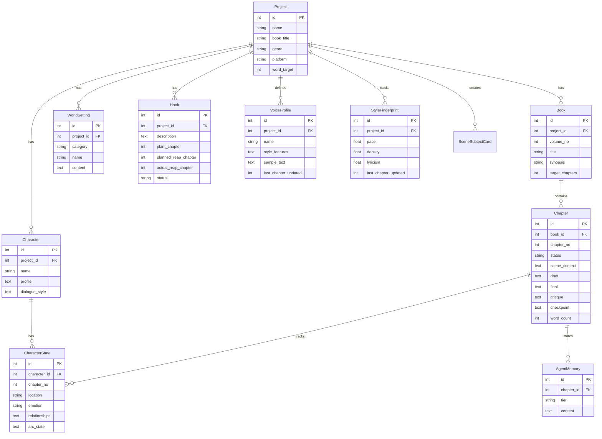
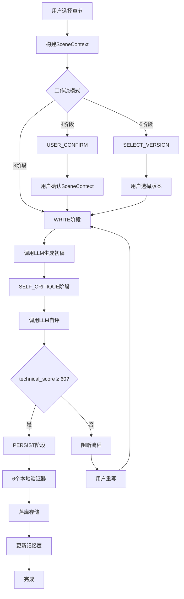
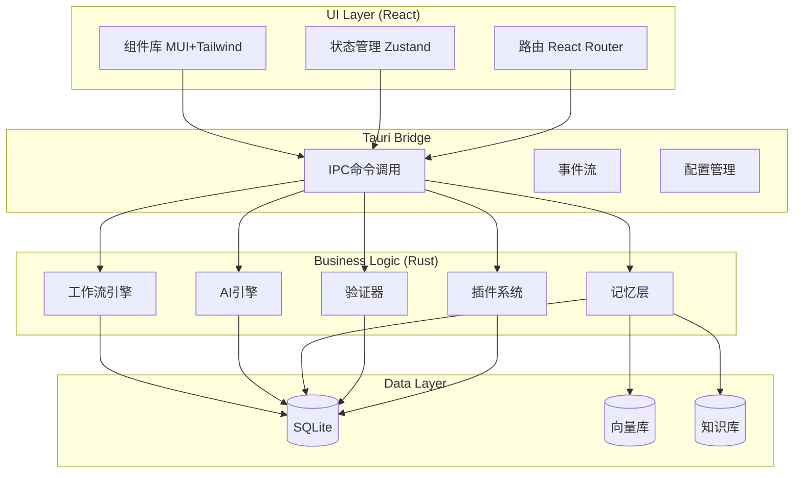

# novel-writer-pure v4 重写 PRD

> **项目信息**
> - 语言：中文
> - 技术栈：Rust + Tauri + React + TypeScript + Vite + MUI + Tailwind CSS
> - 项目名称：novel_writer_pure_v4
> - 原始需求：将 Python+PyQt6 桌面应用 "novel-writer-pure"（AI小说写作工具）从零重写为 Rust + Tauri + React + TypeScript，保留全部46项功能

---

## 1. 产品目标

**一句话定义**：构建一个高性能、跨平台的AI小说写作桌面应用，通过三阶段工作流（WRITE→SELF_CRITIQUE→PERSIST）和四大引导元素（潜文本卡/声音档案/风格指纹/反规则）帮助作者创作高质量小说，支持27+ AI Provider和完整的记忆管理系统。

---

## 2. 用户故事（8条核心故事）

### 2.1 创作流程用户故事

| # | 用户故事 | 优先级 |
|---|----------|--------|
| 1 | 作为小说作者，我想要一个三阶段工作流（WRITE→SELF_CRITIQUE→PERSIST），以便系统化地创作高质量章节 | P0 |
| 2 | 作为小说作者，我想要系统自动注入四大引导元素（潜文本卡/声音档案/风格指纹/反规则），以便AI生成符合角色设定和叙事风格的文本 | P0 |
| 3 | 作为小说作者，我想要系统自动运行六个本地验证器（POV/空间/声音/设定覆盖率/重复检测/物品承诺），以便在不消耗token的情况下保证文本质量 | P0 |
| 4 | 作为小说作者，我想要系统自动管理记忆层（STM/MTM/LTM），以便长期保持故事连贯性和角色一致性 | P0 |
| 5 | 作为小说作者，我想要支持27+ AI Provider和fallback链，以便在任何网络环境下都能继续创作 | P0 |

### 2.2 辅助功能用户故事

| # | 用户故事 | 优先级 |
|---|----------|--------|
| 6 | 作为小说作者，我想要一个可视化仪表盘（追读力趋势/章节统计/用量分析），以便了解创作进度和质量 | P1 |
| 7 | 作为小说作者，我想要一个叙事工坊（压力/情感/节奏/信息差/去重/留白/一致性分析），以便从多个维度优化叙事质量 | P1 |
| 8 | 作为小说作者，我想要一个实体关系图谱（世界图谱），以便可视化角色、地点、物品和伏笔之间的关系 | P2 |

---

## 3. 需求池（P0/P1/P2 分级）

### 3.1 P0：必须实现（核心业务功能）

| # | 功能 | 描述 | 模块 |
|---|------|------|------|
| 1 | **三阶段工作流** | WRITE→SELF_CRITIQUE→PERSIST 流程 | 工作流引擎 |
| 2 | **增强工作流** | 支持 USER_CONFIRM 和 SELECT_VERSION 模式 | 工作流引擎 |
| 3 | **潜文本卡** | 表面事件/真实意图/谎/真/物理锚点 | 引导元素 |
| 4 | **声音档案** | 角色句法+词汇+决策+关系指纹 | 引导元素 |
| 5 | **风格指纹** | pace/density/lyricism 三轴+漂移检测 | 引导元素 |
| 6 | **反规则** | 在 Y 范围内允许打破 X | 引导元素 |
| 7 | **SceneContext 构造** | 一次注入四大引导元素给 Writer | 工作流引擎 |
| 8 | **POV 验证器** | 人称占比，视角一致性 | 验证器 |
| 9 | **空间验证器** | 方向/位置一致性 | 验证器 |
| 10 | **声音验证器** | 角色风格漂移检测 | 验证器 |
| 11 | **设定覆盖率** | 核心设定+活跃伏笔不丢失 | 验证器 |
| 12 | **重复检测** | 句首词频/整句重复/三连短句 | 验证器 |
| 13 | **物品/承诺校验** | 物品一致性+承诺追踪 | 验证器 |
| 14 | **跨章一致性检查** | 跨章设定/物品/对话/时序/情绪一致性 | 验证器 |
| 15 | **世界状态观察器** | 追踪跨章世界状态（数值/事件/状态） | 记忆层 |
| 16 | **自评阻断** | technical_score < 60 时阻断流程 | 工作流引擎 |
| 17 | **AI Provider 管理** | 27+ Provider，fallback 链，流式输出 | AI 引擎 |
| 18 | **题材模板** | 7+ 题材模板（fantasy/mystery/romance等） | AI 引擎 |
| 19 | **记忆分层** | STM/MTM/LTM 三层记忆管理 | 记忆层 |
| 20 | **增量蒸馏** | 4 tier 蒸馏（main_plot/romance/character/worldview/foreshadow） | 记忆层 |
| 21 | **跨章角色状态追踪** | 角色状态随章节变化追踪 | 记忆层 |
| 22 | **核心数据表** | 12 张核心数据表 | 数据层 |
| 23 | **项目管理** | 新建/打开/保存项目 | 系统 |
| 24 | **主题系统** | Solarized Dark/Light 双主题 | UI |

### 3.2 P1：应该实现（重要功能）

| # | 功能 | 描述 | 模块 |
|---|------|------|------|
| 25 | **RAG 混合检索** | 向量库+BM25 关键词检索 | 记忆层 |
| 26 | **知识库** | 内置写作知识库+用户知识库 | 记忆层 |
| 27 | **剧情推演插件** | 多轮 AI 推演剧情走向 | 插件 |
| 28 | **AI 大纲生成** | 一键 AI 生成（世界观/角色/章节大纲/伏笔） | 插件 |
| 29 | **实体关系图谱** | 角色/地点/物品/伏笔关系可视化 | 插件 |
| 30 | **世界状态时间线** | 跨章数值曲线+实体过滤+delta 对比 | 插件 |
| 31 | **世界观编辑器** | JSON/MD 编辑器（JSON 树编辑/MD 预览/Diff/Schema 校验） | 插件 |
| 32 | **用量分析** | Token 统计/API 调用/成本估算/章节用量分布 | 插件 |
| 33 | **导入系统** | 脚本解析优先+AI 兜底（角色/世界观/章节/伏笔） | 系统 |
| 34 | **仪表盘** | 6 metric 卡+追读力趋势+章节列表 | UI |
| 35 | **叙事工坊** | 7 panel（压力/情感/节奏/信息差/去重/留白/一致性） | UI |
| 36 | **记忆管理界面** | 3 子页（蒸馏/RAG/总览） | UI |
| 37 | **14+ Dialog** | UserConfirm/VersionSelect/SelfCritiqueReport 等 | UI |
| 38 | **TTS 朗读** | Edge TTS 语音朗读 | 插件 |
| 39 | **Prompt 管理** | 标准提示词配置 | AI 引擎 |

### 3.3 P2：可以实现（扩展功能）

| # | 功能 | 描述 | 模块 |
|---|------|------|------|
| 40 | **插件系统** | WASM/JS 插件架构 | 系统 |
| 41 | **许可证管理** | 激活/验证 | 系统 |
| 42 | **日志系统** | 日志查看和管理 | 系统 |
| 43 | **自动更新** | tauri-updater 自动更新 | 系统 |
| 44 | **47 UI 测试** | 视觉回归测试 | 质量 |
| 45 | **数据导出** | 项目数据导出（JSON/SQLite） | 系统 |
| 46 | **多语言支持** | 中英文界面 | 系统 |

---

## 4. 数据模型（精简为 12 张核心表）

### 4.1 实体关系图



### 4.2 12 张核心表

| # | 表名 | 描述 | 关键字段 |
|---|------|------|----------|
| 1 | **projects** | 项目列表 | id, name, book_title, genre, platform, word_target |
| 2 | **books** | 分卷 | id, project_id, volume_no, title, synopsis, target_chapters |
| 3 | **chapters** | 章节 | id, book_id, chapter_no, status, scene_context, draft, final, critique, checkpoint, word_count |
| 4 | **characters** | 角色 | id, project_id, name, profile, dialogue_style |
| 5 | **character_states** | 角色状态 | id, character_id, chapter_no, location, emotion, relationships, arc_state |
| 6 | **voice_profiles** | 声音档案 | id, project_id, name, style_features, sample_text, last_chapter_updated |
| 7 | **style_fingerprints** | 风格指纹 | id, project_id, pace, density, lyricism, last_chapter_updated |
| 8 | **world_settings** | 世界观设定 | id, project_id, category, name, content |
| 9 | **hooks** | 伏笔追踪 | id, project_id, description, plant_chapter, planned_reap_chapter, actual_reap_chapter, status |
| 10 | **agent_memory** | Agent 记忆 | id, chapter_id, tier, content |
| 11 | **usage_records** | 用量记录 | id, project_id, chapter_id, provider, tokens_used, cost |
| 12 | **scene_subtext_cards** | 潜文本卡 | id, project_id, chapter_no, surface_event, true_intent, lie, truth, physical_anchor |

**表关系说明**：
- Project 1:N Book（一个项目有多个分卷）
- Book 1:N Chapter（一个分卷有多个章节）
- Project 1:N Character（一个项目有多个角色）
- Project 1:N WorldSetting（一个项目有多个世界观设定）
- Project 1:N Hook（一个项目有多个伏笔）
- Project 1:N VoiceProfile（一个项目有多个声音档案）
- Project 1:N StyleFingerprint（一个项目有一个风格指纹）
- Project 1:N SceneSubtextCard（一个项目有多个潜文本卡）
- Character 1:N CharacterState（一个角色有多个状态记录）
- Chapter 1:N CharacterState（一个章节有多个角色状态）
- Chapter 1:N AgentMemory（一个章节有多条Agent记忆）

---

## 5. UI 设计稿

### 5.1 主窗口布局

```
+--------------------------------------------------+
|  Top Bar (44px)                                  |
|  +新建  打开  保存  |  模型选择  |  设置  |
+--------------------------------------------------+
| 侧栏    |                                        |
| (220px) |      Content Area                      |
|         |      (Tab 切换)                        |
| 创作流程 |                                        |
| --------|                                        |
| 📖 小说设定                                        |
| ✍️ 章节生成                                        |
| 📝 章节编辑                                        |
| 📊 仪表盘                                          |
|         |                                        |
| 智能增强 |                                        |
| --------|                                        |
| 🎭 叙事工坊                                        |
| 🧠 记忆管理                                        |
|         |                                        |
| 其他    |                                        |
| --------|                                        |
| 📋 日志                                            |
| 🕸️ 世界图谱                                        |
| ⚙️ 设置                                            |
|         |                                        |
+--------------------------------------------------+
|  Status Bar (28px)                               |
|  章节: 15 | 字数: 45,230 | 模型: deepseek-chat  |
+--------------------------------------------------+
```

### 5.2 6 Tab 核心功能描述

#### Tab 1: 小说设定
- **左侧**：树形导航（项目→分卷→角色/物品/地点/伏笔/设定）
- **右侧**：详情编辑区
- **子页面**：全局设置 / 世界观设定 / 角色管理 / 大纲编辑
- **关键功能**：AI 一键生成大纲/角色/世界观（ai_outline_gen 插件）

#### Tab 2: 章节生成
- **顶部**：章节选择 + 流程配置（3/4/5阶段）
- **中部**：Agent 配置（模型选择/提示词/温度参数）
- **右侧**：生成结果展示（实时流式输出）
- **底部**：进度指示器（StepIndicator）
- **关键功能**：剧情推演（plot_deduction 插件）、USER_CONFIRM/SELECT_VERSION 对话框

#### Tab 3: 章节编辑
- **左侧**：章节树形列表
- **右侧**：富文本编辑器（支持 Markdown 预览）
- **顶部**：TTS 朗读控制（tts_edge 插件）
- **底部**：自评报告展示区
- **关键功能**：自动保存、版本对比、自评报告对话框

#### Tab 4: 仪表盘
- **顶部**：6 个 metric 卡（总章节/已完成/平均追读力/实体数量/待兑现债务/总字数）
- **中部**：追读力趋势折线图
- **底部**：章节列表表格
- **嵌入**：usage_analytics 插件页面（Token 统计/API 调用/成本估算）

#### Tab 5: 叙事工坊
- **布局**：7 个可折叠 panel
  1. 叙事压力面板
  2. 情感事件面板
  3. 节奏分析面板
  4. 信息差面板
  5. 去重建议面板
  6. 留白检测面板
  7. 一致性报告面板

#### Tab 6: 记忆管理
- **子页面**：
  1. **蒸馏管理**：STM/MTM/LTM 层级展示 + 手动触发蒸馏
  2. **RAG 管理**：向量库状态 + BM25 索引 + 检索测试
  3. **总览**：记忆统计图表 + 搜索功能

### 5.3 关键 Dialog 列表（14+）

| # | Dialog | 触发场景 | 模式 |
|---|--------|----------|------|
| 1 | WelcomeDialog | 首次启动 | modeless |
| 2 | ProjectDialog | 新建/打开项目 | modal |
| 3 | ModelConfigDialog | 设置 AI Provider | modal |
| 4 | UserConfirmDialog | 写作前确认 SceneContext（前 10 章） | modal |
| 5 | VersionSelectDialog | 多版本生成选择 | modal |
| 6 | SelfCritiqueReportDialog | 查看自评报告 | modal |
| 7 | SubtextCardDialog | 编辑潜文本卡 | modal |
| 8 | StyleFingerprintDialog | 查看/编辑风格指纹 | modal |
| 9 | VoiceProfileDialog | 编辑声音档案 | modal |
| 10 | AntiRuleEditorDialog | 编辑反规则 | modal |
| 11 | PluginConfigDialog | 插件管理 | modal |
| 12 | LicenseDialog | 许可证激活 | modal |
| 13 | KnowledgeBaseDialog | 知识库管理 | modal |
| 14 | LogViewerDialog | 日志查看 | modeless |
| 15 | ImportDialog | 数据导入 | modal |
| 16 | ExportDialog | 数据导出 | modal |

---

## 6. 待确认问题

### 6.1 技术实现问题

| # | 问题 | 影响 | 建议 |
|---|------|------|------|
| 1 | **插件系统架构**：原 Python 动态加载插件在 Rust 中如何实现？ | 中 | 建议 Phase 1 先实现硬编码插件，Phase 2 再实现 WASM/JS 插件系统 |
| 2 | **向量库选择**：原 RAG 使用 chromadb，Rust 生态中用哪个？ | 中 | 建议使用 qdrant-rs 或自研轻量级向量库 |
| 3 | **流式输出实现**：如何在 Tauri 中实现 LLM 流式输出的实时 UI 更新？ | 高 | 建议使用 Tauri 事件流 + React 状态管理 |
| 4 | **数据迁移**：用户决定不迁移旧数据，是否需要提供数据导出工具？ | 低 | 建议 P2 阶段提供 JSON/SQLite 导出工具 |

### 6.2 产品设计问题

| # | 问题 | 影响 | 建议 |
|---|------|------|------|
| 5 | **主题系统**：原 35+ 设计 token + 47 UI 测试是否完整保留？ | 中 | 建议保留设计 token，UI 测试可在 Phase 9 补充 |
| 6 | **插件 Tab**：原世界图谱是独立 Tab 还是插件注册的 Tab？ | 低 | 建议作为独立 Tab 实现，简化架构 |
| 7 | **富文本编辑器**：章节编辑使用什么编辑器库？ | 高 | 建议使用 TipTap 或 ProseMirror（React 生态成熟） |
| 8 | **本地验证器**：原 6 个验证器是否需要在前端可视化展示结果？ | 中 | 建议在 PERSIST 阶段后展示验证结果，支持点击查看详情 |

### 6.3 性能与体验问题

| # | 问题 | 影响 | 建议 |
|---|------|------|------|
| 9 | **大文本处理**：10000+ 行章节的编辑性能如何保证？ | 高 | 建议使用虚拟滚动 + 分页加载 |
| 10 | **启动性能**：<1 秒启动如何实现？ | 高 | 建议使用懒加载 + 预编译 + 启动时最小化加载 |
| 11 | **内存管理**：长期运行的内存泄漏如何避免？ | 中 | 建议使用 Rust 的所有权系统 + 定期内存检查 |

---

## 7. 技术架构概览

### 7.1 工作流程图



### 7.2 分层架构

```
┌─────────────────────────────────────┐
│          UI Layer (React)          │
│  - 组件库 (MUI + Tailwind)        │
│  - 状态管理 (Zustand)             │
│  - 路由 (React Router)            │
└───────────────┬─────────────────────┘
                │
┌───────────────▼─────────────────────┐
│       Tauri Bridge (IPC)          │
│  - 命令调用                       │
│  - 事件流                         │
│  - 配置管理                       │
└───────────────┬─────────────────────┘
                │
┌───────────────▼─────────────────────┐
│       Business Logic (Rust)       │
│  - 工作流引擎                     │
│  - AI 引擎                        │
│  - 记忆层                         │
│  - 验证器                         │
└───────────────┬─────────────────────┘
                │
┌───────────────▼─────────────────────┐
│       Data Layer (SQLite)         │
│  - sqlx                           │
│  - 迁移管理                       │
│  - WAL 模式                       │
└─────────────────────────────────────┘
```

### 7.3 组件架构图



### 7.4 关键技术选型

| 层级 | 技术 | 说明 |
|------|------|------|
| **前端** | React 18 + TypeScript | 类型安全 |
| **UI 库** | MUI + Tailwind CSS | 组件库 + 工具类 |
| **状态管理** | Zustand | 轻量级状态管理 |
| **后端** | Rust + Tauri | 高性能 + 跨平台 |
| **数据库** | SQLite + sqlx | 嵌入式数据库 + 异步驱动 |
| **AI SDK** | openai-rs / anthropic-rust | Rust 原生 AI SDK |
| **向量库** | qdrant-rs | Rust 原生向量数据库 |
| **构建工具** | Vite + Cargo | 前端 + 后端构建 |

---

## 8. 实施时间表（1天 AI 写代码）

### 8.1 Phase 1：基础架构（2小时）
- Rust + Tauri + React 项目初始化
- SQLite 数据库 schema 设计
- 基础 CRUD 接口

### 8.2 Phase 2：核心业务（4小时）
- 三阶段工作流引擎
- 四大引导元素实现
- 六个本地验证器
- AI Provider 管理（基础实现）

### 8.3 Phase 3：UI 实现（4小时）
- 主窗口布局（侧栏 + 顶栏 + 状态栏）
- 6 Tab 基础实现
- 核心 Dialog（UserConfirm/VersionSelect/SelfCritiqueReport）

### 8.4 Phase 4：集成测试（2小时）
- 工作流端到端测试
- UI 交互测试
- 性能基准测试

**总计**：12小时（1.5天工作量，AI 并行可压缩到1天）

---

## 9. 成功标准

### 9.1 功能完整性
- ✅ 三阶段工作流完整实现
- ✅ 四大引导元素完整实现
- ✅ 六个本地验证器完整实现
- ✅ 记忆分层管理完整实现

### 9.2 性能指标
- ✅ 启动时间 < 1 秒
- ✅ 章节生成响应时间 < 5 秒（不含 LLM 时间）
- ✅ 10000+ 行章节编辑流畅（无卡顿）
- ✅ 内存占用 < 200MB

### 9.3 用户体验
- ✅ UI 响应时间 < 100ms
- ✅ 主题切换即时生效
- ✅ 错误提示清晰明确
- ✅ 数据自动保存（无丢失）

---

## 10. 附录

### 10.1 参考资料
- 原项目：novel-writer-pure (Python + PyQt6)
- 技术文档：3.0-features-inventory.md
- 设计参考：from-scratch-prd.md
- 用户原型：Solarized Dark + Light 双主题

### 10.2 变更记录
- v1.0 (2025-06-07): 初始 PRD 创建
- 基于用户需求：完整46项功能，不迁移旧数据，1天AI写代码

---

**文档状态**：✅ 已完成  
**创建时间**：2025-06-07  
**产品经理**：许清楚  
**技术栈**：Rust + Tauri + React + TypeScript  
**项目名称**：novel_writer_pure_v4