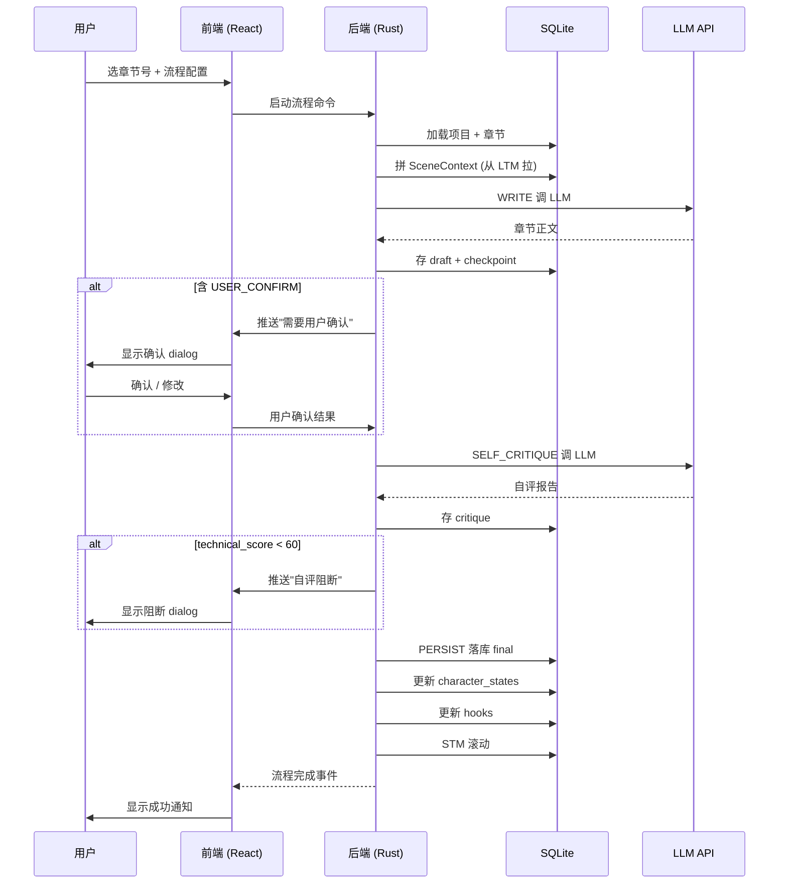
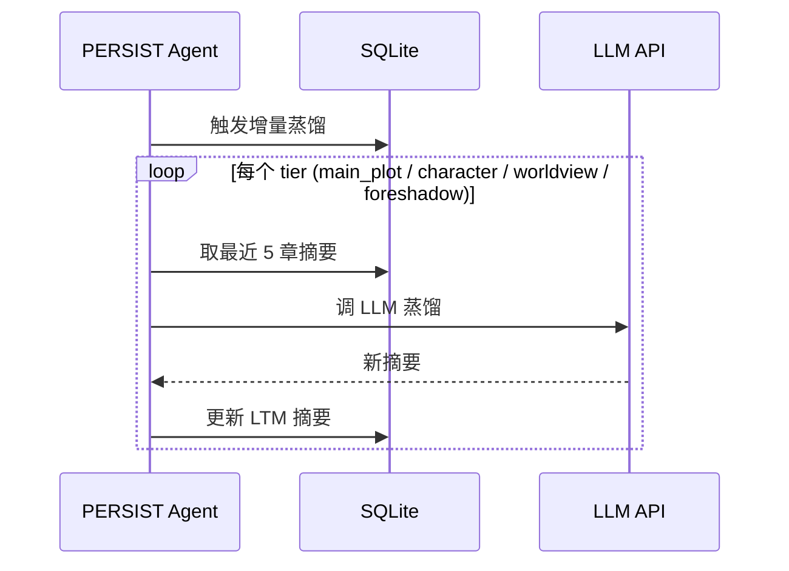

# novel-writer-pure v3 重写：从 0 开始的完整规划

> **重要前提**：保留 3.0 范式（WRITE → SELF_CRITIQUE → PERSIST 三阶段）作为**业务内核**。
> 但**所有代码**从 0 重写——**不修补旧代码**。

---

## 1. 重写目标

1. **业务内核保留**：3.0 三阶段范式（WRITE / SELF_CRITIQUE / PERSIST）
2. **代码从 0 重写**：删除全部 Python 代码，按新设计重写
3. **语言不限制 Python**：选**最适合**这个产品形态的技术栈
4. **UI 按用户原型重做**：2 张原型图（Solarized Dark + Solarized Light）
5. **数据模型优化**：精简 + 树状
6. **全量测试**：UI 47 + 后端 + 视觉回归

---

## 2. 业务内核分析（3.0 范式全方位梳理）

### 2.1 3.0 范式核心

**3 阶段工作流**：
```
WRITE
  ↓ 输出：章节正文 draft
SELF_CRITIQUE
  ↓ 输出：自评报告（4 技术 + 3 品味 = 7 问）
PERSIST
  ↓ 落库：final + 角色状态 + 伏笔状态
```

### 2.2 业务实体清单

基于之前 25 个修复 + 全量审计，3.0 业务实体共 9 类：

| 实体 | 表 | 关键字段 |
|------|------|----------|
| Project 项目 | `projects` | name / book_title / genre / platform / word_target |
| Book 分卷 | `books` | project_id / volume_no / title / synopsis / target_chapters |
| Chapter 章节 | `chapters` | book_id / chapter_no / status / scene_context / draft / final / critique / checkpoint / word_count |
| Character 角色 | `characters` | project_id / name / profile (性格/对话风格) |
| CharacterState 角色状态 | `character_states` | character_id / chapter_no / emotion / location / relationships / arc_state |
| Item 物品 | `items` | project_id / name / holder_id / location / first_chapter / last_mentioned |
| Location 地点 | `locations` | project_id / name / description / rules |
| Hook 伏笔 | `hooks` | project_id / description / introduced_chapter / resolved_chapter / status |
| WorldSetting 设定 | `world_settings` | project_id / category / key / value / description |
| VoiceProfile 声音档案 | `voice_profiles` | project_id / name / style_features / sample_text |

### 2.3 业务流程梳理

**主流程**：写 1 章
1. 用户在主窗口选"章节生成" Tab
2. 选章节号 + 流配置（3 阶段 / 4 阶段含 USER_CONFIRM / 5 阶段含 SELECT_VERSION）
3. 点"开始写作"
4. WRITE 阶段：拼 SceneContext + 调 LLM + 后处理
5. （可选）USER_CONFIRM 阶段：用户确认 SceneContext
6. SELF_CRITIQUE 阶段：调 LLM 自评 + 解析报告
7. PERSIST 阶段：落库 + 更新衍生数据 + 触发蒸馏
8. 流程完成 / 失败

**辅助流程**：
- **记忆蒸馏**（每章完成后自动）：STM → MTM → LTM
- **RAG 检索**（写作时被动调用）：向量库 top-k 召回
- **验证器**（写入时被动检查）：item_validator / promise_validator
- **大纲生成**（独立流程）：生成 Book 梗概 + 章节大纲
- **世界图谱**（独立流程）：可视化角色关系

### 2.4 关键问题（基于之前 25 个修复）

| 问题 | 解决 |
|------|------|
| StepIndicatorV3 默认 4 步（应是 3）| 新设计强制默认 3 步 |
| agent_config 多套并存 | 单一 schema + 场景别名 |
| 2.0 名称残留（PLANNER/AUDITOR/REVISER）| 全部删除 |
| prompts.py question_count=9（2.0）| 重写 7 问模板 |
| 12+ Dialog 风格不统一 | 统一 Dialog 基类 |
| 6 Tab 视觉不对齐 | 重排 widget 树 |
| 25 个 widget 未监听主题 | 全量加 polish 监听 |
| json.load 无 isinstance 校验 | 用强类型加载器 |

---

## 3. 技术栈选型（重新选，不限 Python）

### 候选方案对比（客观评估）

| 维度 | Python+PyQt | Rust+Tauri+React | Go+Wails+React | Electron+TS |
|------|-------------|------------------|----------------|------------|
| 启动速度 | 3-5秒 | <1秒 | <1秒 | 2-3秒 |
| 打包体积 | 200MB+ | 5-15MB | 20-30MB | 100MB+ |
| 内存占用 | 高 | 低 | 中 | 高 |
| AI SDK 生态 | 丰富 | 较丰富 | 较少 | 丰富 |
| 跨平台 | 好 | 好 | 好 | 好 |
| 学习曲线 | 低 | 中-高 | 中 | 低 |
| 性能（大文本/向量）| 中 | 高 | 高 | 低-中 |
| 长期可持续 | 中 | 高 | 中 | 中 |

### 选型推荐：Rust + Tauri + React

**核心理由**：

1. **性能**：写作软件 = 大文本 + AI 调用 + 向量检索
   - 10000+ 行章节不卡
   - LLM 流式输出打字效果（Rust tokio 异步强）
   - 向量检索（chromadb-rs）快
2. **打包小**：5-15MB vs PyQt 200MB+——用户下载/更新友好
3. **启动快**：<1秒——打开就开写
4. **类型安全**：Rust + TypeScript 双重类型检查
5. **AI SDK**：
   - openai-rs（成熟）
   - anthropic-rust（成熟）
   - ollama-rs（成熟）
6. **跨平台**：Win/Mac/Linux 一套代码
7. **未来 5 年不会过时**：Rust 生态在增长

### 风险与缓解

| 风险 | 缓解 |
|------|------|
| Rust 学习曲线 | 团队 1-2 人专门学习，2-3 周上手 |
| 前端工程化 | React + TypeScript + Vite 模板已成熟 |
| AI SDK 不全 | HTTP 直接调（OpenAI/Anthropic/Ollama 都 HTTP 协议）|
| 迁移旧数据 | 写一次性导入工具（v3 SQLite → v3.1 SQLite）|

---

## 4. UI 设计（按用户原型重做）

### 4.1 设计原则

1. **简洁**：每屏不超过 7 个主要元素
2. **清晰**：视觉层次分明（侧栏 < 顶栏 < 内容 < 状态栏）
3. **高效**：键盘流优先，鼠标辅助
4. **Solarized 配色**：8 强调色 + 16 基色（深/浅切换）

### 4.2 主窗口（按原型 1:1）

```
+------+--------------------------+
| Side |  Top Bar  (44px)        |
| bar  | +新建 打开 保存 | 模型 | 设置 |
| 220  +--------------------------+
| px   |                          |
|      |    Content Area           |
| 9 项 |  - 6 Tab（按场景）       |
| 导航 |  - 子页（按 Tab）        |
|      |                          |
|      |                          |
|      +--------------------------+
|      |  Status Bar  (28px)      |
+------+--------------------------+
```

### 4.3 9 项侧栏导航

按"创作流程 / 智能增强 / 其他"3 组：

**创作流程**：
- 📖 小说设定
- ✍️ 章节生成
- 📝 章节编辑
- 📊 仪表盘

**智能增强**：
- 🎭 叙事工坊
- 🧠 记忆管理

**其他**：
- 📋 日志
- 🕸️ 世界图谱
- ⚙️ 设置（重设计：放侧栏底部）

### 4.4 6 Tab 内容

| Tab | 主要内容 |
|------|----------|
| 小说设定 | 项目 / 分卷 / 角色 / 物品 / 地点 / 伏笔 / 设定 / 声音档案（左侧树 + 右侧详情）|
| 章节生成 | 流程控制（3 阶段 / 4 阶段 / 5 阶段）+ Agent 配置 + 生成结果 |
| 章节编辑 | 树形章节列表 + 富文本编辑 + 自评报告展示 |
| 仪表盘 | 6 个 metric 卡（总章节/已完成/平均追读力/实体数量/待兑现债务/总字数）+ 追读力趋势 + 章节列表 |
| 叙事工坊 | 7 个 panel（压力/情感/节奏/信息差/去重/留白/一致性）|
| 记忆管理 | 3 子页（蒸馏 / RAG / 总览）|

### 4.5 14 个 Dialog

| Dialog | 触发场景 | 模式 |
|--------|----------|------|
| WelcomeDialog | 首次启动 | modeless |
| ProjectDialog | 新建/打开项目 | modal |
| ModelConfigDialog | 设置 | modal |
| UserConfirmDialog | 写作前确认 SceneContext（前 10 章）| modal |
| VersionSelectDialog | 多版本生成 | modal |
| SelfCritiqueReportDialog | 自评报告 | modal |
| SubtextCardDialog | 潜文本任务卡 | modal |
| StyleFingerprintDialog | 风格指纹 | modal |
| VoiceProfileDialog | 声音档案编辑器 | modal |
| AntiRuleEditorDialog | 反规则编辑器 | modal |
| PluginConfigDialog | 插件管理 | modal |
| LicenseDialog | 许可证激活 | modal |
| KnowledgeBaseDialog | 知识库管理 | modal |
| LogViewerDialog | 日志查看 | modeless |

### 4.6 配色系统

**Solarized Dark**：
- bg_base: `#002b36` (base03)
- bg_elevated: `#073642` (base02)
- bg_overlay: `#0a4554`
- bg_sidebar: `#073642`
- accent_primary: `#268bd2` (blue)
- accent_secondary: `#2aa198` (cyan, 用于 3 阶段中 WRITE)
- accent_info: `#6c71c4` (violet, 用于 3 阶段中 PERSIST)
- text_primary: `#eee8d5` (base2)
- text_secondary: `#93a1a1` (base1)
- text_muted: `#586e75` (base01)
- border_default: `#0a4554`
- border_strong: `#586e75`

**Solarized Light**：
- bg_base: `#fdf6e3` (base3 米黄)
- bg_elevated: `#eee8d5` (base2)
- accent_primary: `#1e6eaa` (深 blue)
- text_primary: `#073642` (base02)
- 其他对应调整

### 4.7 状态色

- success: `#859900` (green)
- warning: `#b58900` (yellow)
- danger: `#dc322f` (red)
- info: `#268bd2` (blue)
- accent_secondary: `#2aa198` (cyan, WRITE)
- accent_info: `#6c71c4` (violet, PERSIST)

---

## 5. 数据模型（精简 + 树状）

### 5.1 关系图

```
Project (1) ── (N) Book (1) ── (N) Chapter
   │
   ├─ (N) Character ── (N) CharacterState
   ├─ (N) Item
   ├─ (N) Location
   ├─ (N) Hook
   ├─ (N) WorldSetting
   └─ (N) VoiceProfile
```

### 5.2 字段精简

- **Chapter 自带** draft / final / critique / checkpoint（不外挂 4 张表）
- **Item + Hook 合并视图**（都是"会被回响的设定"）
- **CharacterState 按章节号查**（不存关系表）
- **VoiceProfile 独立**（不绑角色，写作风格可复用）

---

## 6. 业务流程时序图

### 6.1 主流程：写 1 章



### 6.2 辅助流程：记忆蒸馏



---

## 7. 实施分阶段（10 周）

### Phase 0：环境搭建（1 周）
- 安装 Rust + Tauri + Node + pnpm
- 创建 v3-novel-writer 仓库（保留旧仓库作归档）
- 搭建项目结构
- CI/CD 基础

### Phase 1：核心数据层（1.5 周）
- Rust 项目结构（lib + bin）
- SQLite schema（10 张表 + 迁移）
- sqlx 模型 + 迁移工具
- CRUD 通用接口
- 单元测试（每张表）

### Phase 2：业务逻辑层（2 周）
- 3 阶段工作流引擎
- Agent 注册中心（WriteAgent / CritiqueAgent / PersistAgent / OutlineAgent / DistillAgent / RagAgent / UserConfirmGate）
- 模板/提示词管理
- 记忆层（STM / MTM / LTM + 蒸馏 + RAG）
- 验证器（item_validator / promise_validator 等）
- 集成测试

### Phase 3：AI 集成（1 周）
- OpenAI HTTP 客户端
- Anthropic HTTP 客户端
- Ollama HTTP 客户端
- 流式输出
- 失败重试 + 错误处理

### Phase 4：Tauri 桥（0.5 周）
- 前端 ↔ Rust 命令（IPC）
- 事件流（工作流进度推送）
- 配置管理

### Phase 5：前端基础（1 周）
- React 18 + Vite + TypeScript + Tailwind + shadcn/ui
- 主题系统（Solarized 官方色）
- 状态管理（Zustand）
- 路由（React Router）

### Phase 6：主窗口 + 侧栏（1 周）
- 220px 侧栏（9 项导航）
- 44px 顶栏（新建/打开/保存/模型/设置）
- 28px 状态栏
- Tab 切换框架

### Phase 7：6 Tab（2 周）
- 小说设定（树状 + 详情，最复杂）
- 章节生成（流程控制 + Agent 配置）
- 章节编辑（富文本 + 自评）
- 仪表盘（metric 卡 + 趋势图）
- 叙事工坊（7 panel）
- 记忆管理（3 子页）

### Phase 8：14 Dialog（1 周）
- 按重要度排：UserConfirm / VersionSelect / SelfCritiqueReport / SubtextCard / StyleFingerprint / VoiceProfile / AntiRuleEditor / PluginConfig / License / KnowledgeBase / LogViewer / Welcome / Project / ModelConfig

### Phase 9：测试 + 视觉回归（1 周）
- 单元测试（Rust + Vitest）
- 集成测试
- Playwright 视觉回归（截深/浅主题对比）
- 性能压测

### Phase 10：打包 + 分发（0.5 周）
- Tauri 打包 Win/Mac/Linux
- 自动更新（tauri-updater）
- 文档 + 许可
- 旧 v3 数据迁移工具

**总工作量估算**：10-12 周（如果团队 1-2 人 Rust 熟手）

---

## 8. 风险与决策

| 风险 | 概率 | 影响 | 缓解 |
|------|------|------|------|
| Rust 学习曲线 | 中 | 中 | 先用 1 周专门学习 + 1 周做小项目 |
| 旧数据迁移 | 高 | 高 | 写数据导出工具（JSON / SQLite）从 v3 导入 |
| 旧插件不兼容 | 中 | 中 | 旧 plugins/ 列清单，**全部按新 API 重写** |
| AI 调用稳定性 | 中 | 高 | 多家 fallback（OpenAI → Anthropic → Ollama）|
| 用户体验倒退 | 中 | 高 | 按用户原型 1:1 还原（每 Tab 截图对比）|

---

## 9. 决策点（请回复）

1. **技术栈选型**：A. Rust+Tauri+React（推荐） / B. Python+PyQt（保守） / C. Go+Wails+React？
2. **数据迁移策略**：A. 全量迁移旧 SQLite / B. 只迁移用户主动导出 / C. 不迁移（用户手动复制粘贴）？
3. **插件策略**：A. 旧 plugins/ 全部重写 / B. 列出保留的 + 重写其余 / C. 暂时无插件？
4. **是否启动重写**：A. 现在启动 / B. 先写完 spec 再说？

你回复"1A 2A 3A 4A"或"全 A"，我立即开始 Phase 0。
